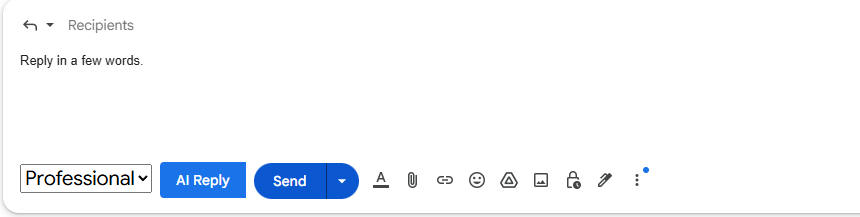

# Mail Cinnamon

**MailCinnamon** is a Chrome Extension + Web App ecosystem designed to help users generate professional, friendly, or custom-tailored email replies with AI. It acts like your smart email secretary — instantly composing replies based on the current thread and your tone preferences.

---

## 🧩 Project Structure

```
MailCinnamon/
├── Mail-Cinnamon-backend    # Node.js/Express API for handling AI requests
├── Mail-Cinnamon-ext        # Chrome Extension (Gmail integration)
├── Mail-Cinnamon-frontend   # Web UI (React + Vite + MUI)
```

---

## 🚀 Features
- **Google Chrome Integration** – Works seamlessly within Gmail with no setup required; just click and generate

- 📬 **Smart Gmail Reply Extension** – Quickly generate AI-powered replies in Gmail
- 🧠 **Tone Selection** – Choose tone (e.g., Professional, Friendly)
- 📝 **User Prompt Aware** – Add optional instructions like “be shorter” or “more enthusiastic”
- ⚙️ **Backend API** – Handles prompt generation and connects to AI providers (Gemini)
- 🌐 **Frontend** – Management or onboarding portal (React + Vite + MUI)


---


## 🛠 Tech Stack

### 🔧 Backend (`Mail-Cinnamon-backend`)
- Java 17
- Spring Boot
- Maven
- RESTful API
- Environment-based configuration (e.g., `GEMINI_API_URL`, `GEMINI_API_KEY`)
- Gemini LLM API integration

### 🧩 Chrome Extension (`Mail-Cinnamon-ext`)
- JavaScript (ES6+)
- DOM MutationObserver
- Gmail DOM integration
- Custom tone selector + AI reply button
- Content script injection (Manifest V3)

### 🌐 Frontend (`Mail-Cinnamon-frontend`)
- React
- Vite
- MUI (Material UI)
- Axios for API communication

--- 
## 🛠️ Setup Instructions

### 1. Clone the Repository

```bash
git clone https://github.com/your-username/MailCinnamon.git
cd MailCinnamon
```

### 2. Backend Setup (`Mail-Cinnamon-backend`)

> The backend is a Java Spring Boot application built with Maven. It connects to the Gemini API to generate email replies.

#### ✅ Requirements

- Java 17+
- Maven 3.x

#### ✅ Environment Variables

Before running the backend, make sure to export the following environment variables:

```bash
# Linux / macOS
export GEMINI_API_URL=https://your-gemini-endpoint
export GEMINI_API_KEY=your-api-key
```

```powershell
# Windows PowerShell
$env:GEMINI_API_URL="https://your-gemini-endpoint"
$env:GEMINI_API_KEY="your-api-key"
```

You can also add them to your system’s environment variables for persistence.

#### ✅ Run the server

```bash
cd Mail-Cinnamon-backend
mvn clean install
mvn spring-boot:run
```

> The backend will start at `http://localhost:8080` by default.

### 3. Chrome Extension (`Mail-Cinnamon-ext`)

- Go to `chrome://extensions`
- Enable **Developer Mode**
- Click **Load unpacked** and select the `Mail-Cinnamon-ext` folder
- Make sure the backend server is running

### 4. Frontend App (`Mail-Cinnamon-frontend`)

```bash
cd Mail-Cinnamon-frontend
npm install
npm run dev
```

> Note: You can use the frontend for managing templates, settings, or future user flows.

---

## 📦 Build

To build the frontend for production:

```bash
cd Mail-Cinnamon-frontend
npm run build
```

To prepare the extension for release, zip the `Mail-Cinnamon-ext` folder.

---

## 📄 License

MIT © [CaffeinY]

---

## 🧠 Future Ideas

- Support multiple LLM providers by introducing a configurable backend model abstraction.
- Extend integration beyond Gmail — for example, support native email clients on Windows, not just as a Chrome extension.


---


## 📚 Acknowledgements

This project is originally inspired by the following tutorial:

[📺 Tutorial Title or Link Here](https://youtu.be/hpiO9CKkKfU?list=PLxhSr_SLdXGNCwu3jMlwczL_m6hVTsXQc)

I followed the video to learn the fundamentals, and then made the following modifications:

- Restructured the project into three separate modules: frontend, backend, and extension
- Improved tone selection UI
- Added user prompt extraction from Gmail reply box
- Enhanced prompt formatting and backend response handling

All rights belong to the original author for their tutorial content. This repository is for educational and personal learning purposes.

